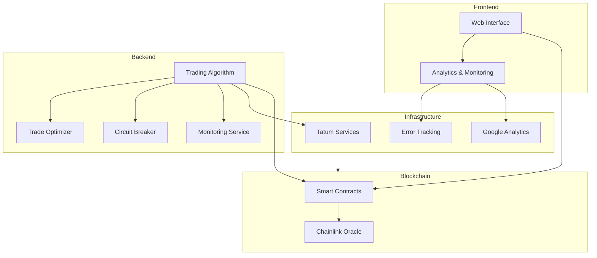

# Architecture Overview

The Synthetic Stablecoin Platform is built with a modular architecture consisting of three main components:

1. Smart Contracts (Blockchain Layer)
2. Trading Algorithm (Backend)
3. Web Interface (Frontend)

## System Architecture



## Component Overview

### 1. Smart Contracts (Blockchain Layer)

- **MasterControl.sol**: Main contract managing token minting/burning
- **Role-based access control** for secure operations
- **Chainlink integration** for price feeds
- **Collateral management** system

### 2. Trading Algorithm (Backend)

- **Python-based** algorithmic trading system
- **Components**:
  - Circuit Breaker for risk management
  - Trade Optimizer for gas and timing optimization
  - Monitoring Service for metrics and alerts
  - Tatum integration for blockchain interaction

### 3. Web Interface (Frontend)

- **React-based** dashboard
- **Features**:
  - Real-time price monitoring
  - Trading interface
  - Analytics integration
  - Error tracking
  - Responsive design

## Data Flow

1. **Price Updates**:
   ```mermaid
   sequenceDiagram
       Chainlink->>Smart Contract: Update Price
       Smart Contract->>Trading Algorithm: Price Event
       Trading Algorithm->>Circuit Breaker: Validate Trade
       Circuit Breaker->>Trade Optimizer: Optimize Execution
       Trade Optimizer->>Trading Algorithm: Execute Trade
       Trading Algorithm->>Smart Contract: Mint/Burn Tokens
   ```

2. **User Interactions**:
   ```mermaid
   sequenceDiagram
       User->>Frontend: Initiate Action
       Frontend->>Smart Contract: Send Transaction
       Smart Contract->>Frontend: Confirm Transaction
       Frontend->>Analytics: Log Event
   ```

## Security Architecture

1. **Smart Contract Security**:
   - Role-based access control
   - Reentrancy protection
   - Pausable functionality
   - Secure math operations

2. **Backend Security**:
   - Circuit breaker protection
   - Rate limiting
   - API key rotation
   - Secure environment variables

3. **Frontend Security**:
   - Secure key management
   - Input validation
   - Error boundaries
   - XSS protection

## Infrastructure

1. **Blockchain Infrastructure**:
   - Polygon network
   - Chainlink oracles
   - Tatum RPC nodes
   - WebSocket connections

2. **Monitoring Infrastructure**:
   - Prometheus metrics
   - Grafana dashboards
   - Sentry error tracking
   - Google Analytics

3. **Development Infrastructure**:
   - GitHub Actions CI/CD
   - Vercel deployment
   - Testing frameworks
   - Code quality tools

## Performance Considerations

1. **Smart Contracts**:
   - Gas optimization
   - Batch processing
   - Event optimization
   - Storage optimization

2. **Trading Algorithm**:
   - Async operations
   - Connection pooling
   - Memory management
   - Cache optimization

3. **Frontend**:
   - Code splitting
   - Lazy loading
   - Performance monitoring
   - CDN integration

## Scaling Considerations

1. **Horizontal Scaling**:
   - Multiple trading algorithm instances
   - Load balancing
   - Database sharding
   - Cache distribution

2. **Vertical Scaling**:
   - Resource optimization
   - Performance tuning
   - Memory management
   - CPU optimization

## Future Architecture

Planned improvements:

1. **Layer 2 Integration**:
   - Optimistic rollups
   - ZK rollups
   - State channels

2. **Advanced Features**:
   - Multi-token support
   - Cross-chain bridges
   - Advanced trading strategies
   - Automated portfolio management

3. **Infrastructure Upgrades**:
   - Distributed system architecture
   - Advanced monitoring
   - AI/ML integration
   - Enhanced security features 