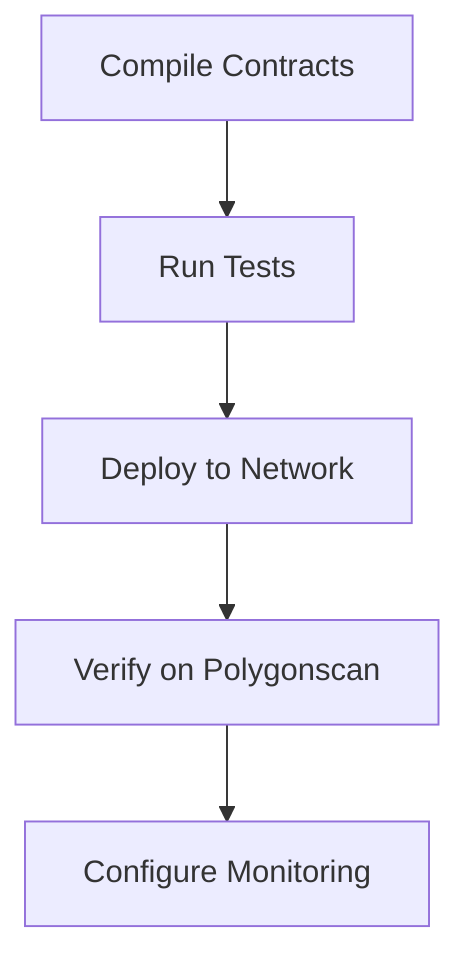
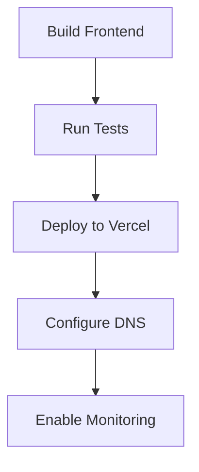
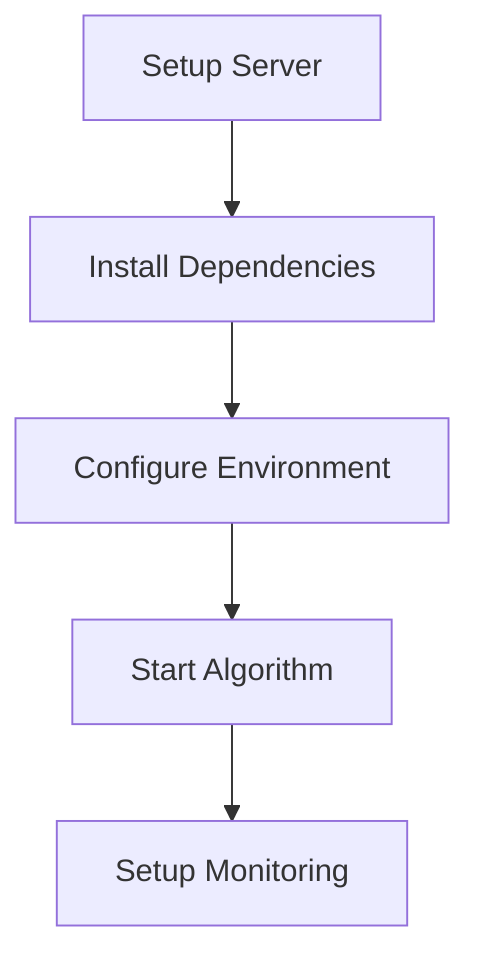

# Deployment Guide

This guide covers the deployment process for all components of the Synthetic Stablecoin Platform.

## Overview

The platform consists of three main components that need to be deployed:

1. Smart Contracts (Polygon Network)
2. Frontend Application (Vercel)
3. Trading Algorithm (Server)

## Deployment Checklist

- [ ] Environment variables configured
- [ ] Smart contracts deployed and verified
- [ ] Frontend application deployed
- [ ] Trading algorithm running
- [ ] Monitoring systems active
- [ ] Security measures in place

## Prerequisites

- Tatum API key
- Polygon RPC endpoint
- Vercel account
- Server with Python 3.8+
- GitHub account
- Environment variables ready

## Quick Start

1. Deploy smart contracts:
   ```bash
   cd contracts
   npx hardhat run scripts/deploy.ts --network polygon
   ```

2. Deploy frontend:
   ```bash
   cd frontend
   vercel deploy
   ```

3. Deploy trading algorithm:
   ```bash
   cd backend
   python3 -m pip install -r requirements.txt
   python3 trading_algorithm.py
   ```

See detailed instructions in the respective deployment guides:
- [Smart Contract Deployment](smart-contract.md)
- [Frontend Deployment](frontend.md)
- [Trading Algorithm Deployment](trading-algorithm.md)

## Environment Variables

### Smart Contracts
```env
POLYGON_RPC_URL=
PRIVATE_KEY=
POLYGONSCAN_API_KEY=
```

### Frontend
```env
REACT_APP_MASTER_CONTROL=
REACT_APP_GA_MEASUREMENT_ID=
REACT_APP_SENTRY_DSN=
```

### Trading Algorithm
```env
TATUM_API_KEY=
MASTER_CONTROL_ADDRESS=
WEBHOOK_URL=
```

## Deployment Environments

### Development
- Polygon Mumbai Testnet
- Vercel Preview Deployments
- Local trading algorithm

### Staging
- Polygon Mumbai Testnet
- Vercel Staging Environment
- Test server deployment

### Production
- Polygon Mainnet
- Vercel Production Environment
- Production server deployment

## Infrastructure Setup

1. **Blockchain Infrastructure**
   - Tatum RPC nodes
   - Chainlink price feeds
   - Contract monitoring

2. **Frontend Infrastructure**
   - Vercel deployment
   - CDN configuration
   - DNS setup

3. **Backend Infrastructure**
   - Server provisioning
   - Database setup
   - Monitoring configuration

## Deployment Process

### 1. Smart Contract Deployment



### 2. Frontend Deployment



### 3. Trading Algorithm Deployment



## Post-Deployment Checklist

### Smart Contracts
- [ ] Contracts verified on Polygonscan
- [ ] Price feeds working
- [ ] Events being emitted
- [ ] Roles properly assigned

### Frontend
- [ ] Application loads correctly
- [ ] Wallet connection works
- [ ] Transactions working
- [ ] Analytics tracking
- [ ] Error tracking active

### Trading Algorithm
- [ ] Algorithm running
- [ ] Monitoring active
- [ ] Alerts configured
- [ ] Logs being generated

## Monitoring Setup

1. **Infrastructure Monitoring**
   - Server metrics
   - Network status
   - Resource usage

2. **Application Monitoring**
   - Transaction success rate
   - Gas usage
   - Price stability
   - Trading volume

3. **Error Monitoring**
   - Sentry for frontend
   - Log aggregation
   - Alert configuration

## Rollback Procedures

### Smart Contracts
1. Pause current contract
2. Deploy previous version
3. Update frontend references
4. Update trading algorithm

### Frontend
1. Identify failing deployment
2. Revert to last working version
3. Clear cache if needed
4. Update DNS if needed

### Trading Algorithm
1. Stop current instance
2. Restore from backup
3. Start previous version
4. Verify monitoring

## Security Considerations

1. **Access Control**
   - Secure key management
   - Role assignments
   - API access

2. **Infrastructure Security**
   - Firewall configuration
   - Network security
   - Server hardening

3. **Application Security**
   - Input validation
   - Transaction signing
   - Rate limiting

## Troubleshooting

Common deployment issues and solutions:

1. **Smart Contract Issues**
   - Verification failures
   - Gas estimation errors
   - Role assignment problems

2. **Frontend Issues**
   - Build failures
   - Environment variables
   - Connection issues

3. **Trading Algorithm Issues**
   - Dependency conflicts
   - Connection timeouts
   - Memory issues

## Maintenance

Regular maintenance tasks:

1. **Daily**
   - Monitor logs
   - Check alerts
   - Verify transactions

2. **Weekly**
   - Update dependencies
   - Backup data
   - Review metrics

3. **Monthly**
   - Security updates
   - Performance review
   - Infrastructure scaling 