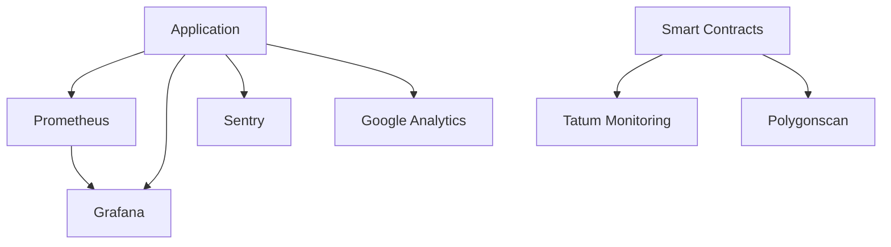

# Monitoring Setup

This document details the monitoring infrastructure and setup for the Synthetic Stablecoin Platform.

## Overview

The platform implements comprehensive monitoring across all components:

1. Infrastructure Monitoring
2. Application Monitoring
3. Blockchain Monitoring
4. Security Monitoring

## Monitoring Infrastructure

### Components



## Metrics Collection

### Prometheus Setup

1. **Installation**
```bash
# Install Prometheus
wget https://github.com/prometheus/prometheus/releases/download/v2.40.0/prometheus-2.40.0.linux-amd64.tar.gz
tar xvfz prometheus-*.tar.gz
cd prometheus-*
```

2. **Configuration**
```yaml
global:
  scrape_interval: 15s
  evaluation_interval: 15s

scrape_configs:
  - job_name: 'trading_algorithm'
    static_configs:
      - targets: ['localhost:8000']
  
  - job_name: 'node_exporter'
    static_configs:
      - targets: ['localhost:9100']
```

### Trading Algorithm Metrics

```python
# Prometheus metrics
TRADES_TOTAL = Counter('trades_total', 'Total number of trades')
TRADES_SUCCESS = Counter('trades_success', 'Successful trades')
TRADES_FAILED = Counter('trades_failed', 'Failed trades')
GAS_USED = Counter('gas_used_total', 'Total gas used')
TRADE_DURATION = Histogram('trade_duration_seconds', 'Trade duration')
```

## Dashboard Setup

### Grafana Configuration

1. **Installation**
```bash
# Install Grafana
sudo apt-get install -y software-properties-common
sudo add-apt-repository "deb https://packages.grafana.com/oss/deb stable main"
sudo apt-get update
sudo apt-get install grafana
```

2. **Dashboard Configuration**
```json
{
  "dashboard": {
    "id": null,
    "title": "Trading Metrics",
    "panels": [
      {
        "title": "Trade Success Rate",
        "type": "graph",
        "datasource": "Prometheus",
        "targets": [
          {
            "expr": "rate(trades_success[5m]) / rate(trades_total[5m])"
          }
        ]
      }
    ]
  }
}
```

## Alert Configuration

### Alert Rules

1. **Trading Alerts**
```yaml
groups:
  - name: trading_alerts
    rules:
      - alert: HighTradeFailureRate
        expr: rate(trades_failed[5m]) / rate(trades_total[5m]) > 0.1
        for: 5m
        labels:
          severity: warning
        annotations:
          summary: High trade failure rate detected
          
      - alert: GasPriceSpike
        expr: ethereum_gas_price > 100
        for: 2m
        labels:
          severity: warning
        annotations:
          summary: Gas price spike detected
```

2. **System Alerts**
```yaml
groups:
  - name: system_alerts
    rules:
      - alert: HighMemoryUsage
        expr: node_memory_MemAvailable_bytes / node_memory_MemTotal_bytes * 100 < 10
        for: 5m
        labels:
          severity: warning
        annotations:
          summary: High memory usage detected
```

## Logging Setup

### Log Configuration

1. **Application Logging**
```python
# Configure structured logging
logging.config.dictConfig({
    'version': 1,
    'disable_existing_loggers': False,
    'formatters': {
        'json': {
            '()': 'pythonjsonlogger.jsonlogger.JsonFormatter',
            'format': '%(timestamp)s %(level)s %(name)s %(message)s'
        }
    },
    'handlers': {
        'console': {
            'class': 'logging.StreamHandler',
            'formatter': 'json'
        },
        'file': {
            'class': 'logging.handlers.RotatingFileHandler',
            'filename': 'app.log',
            'formatter': 'json',
            'maxBytes': 10485760,
            'backupCount': 5
        }
    },
    'root': {
        'level': 'INFO',
        'handlers': ['console', 'file']
    }
})
```

2. **Log Aggregation**
```yaml
# Filebeat configuration
filebeat.inputs:
- type: log
  enabled: true
  paths:
    - /var/log/trading_algorithm/*.log
  json.keys_under_root: true

output.elasticsearch:
  hosts: ["elasticsearch:9200"]
```

## Performance Monitoring

### System Metrics

1. **Resource Usage**
```python
def monitor_system_resources():
    # CPU usage
    cpu_percent = psutil.cpu_percent()
    # Memory usage
    memory = psutil.virtual_memory()
    # Disk usage
    disk = psutil.disk_usage('/')
    
    return {
        'cpu_percent': cpu_percent,
        'memory_percent': memory.percent,
        'disk_percent': disk.percent
    }
```

2. **Network Metrics**
```python
def monitor_network():
    # Network I/O
    network = psutil.net_io_counters()
    return {
        'bytes_sent': network.bytes_sent,
        'bytes_recv': network.bytes_recv,
        'packets_sent': network.packets_sent,
        'packets_recv': network.packets_recv
    }
```

## Blockchain Monitoring

### Transaction Monitoring

1. **Tatum Setup**
```javascript
const setupMonitoring = async () => {
    await tatum.monitoring.createSubscription({
        type: "ADDRESS_MONITORING",
        attr: {
            address: contractAddress,
            chain: "MATIC",
            url: webhookUrl
        }
    });
};
```

2. **Event Monitoring**
```javascript
const monitorEvents = async () => {
    contract.on("PriceUpdated", (price) => {
        logPriceUpdate(price);
    });
    
    contract.on("CollateralDeposited", (user, amount) => {
        logCollateralDeposit(user, amount);
    });
};
```

## Visualization

### Metrics Dashboard

1. **Trading Metrics**
   - Trade success rate
   - Gas usage
   - Price stability
   - Trading volume

2. **System Metrics**
   - CPU/Memory usage
   - Network I/O
   - Disk usage
   - Error rates

3. **Blockchain Metrics**
   - Transaction success
   - Gas prices
   - Block times
   - Contract events

## Maintenance

### Regular Tasks

1. **Daily**
   - Review alerts
   - Check logs
   - Verify metrics
   - Monitor resources

2. **Weekly**
   - Analyze trends
   - Update dashboards
   - Review thresholds
   - Backup logs

3. **Monthly**
   - Performance review
   - Capacity planning
   - Alert tuning
   - Documentation update

## Troubleshooting

### Common Issues

1. **Metric Collection**
   - Check Prometheus endpoints
   - Verify scrape configs
   - Check service status
   - Review firewall rules

2. **Alert Issues**
   - Verify alert rules
   - Check notification channels
   - Test alert pipeline
   - Review alert history

3. **Logging Issues**
   - Check log rotation
   - Verify disk space
   - Test log shipping
   - Review log levels 